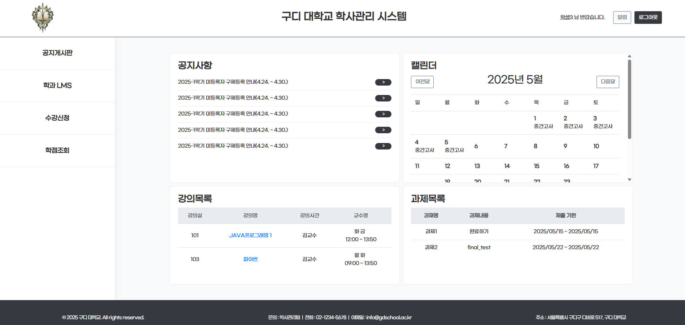
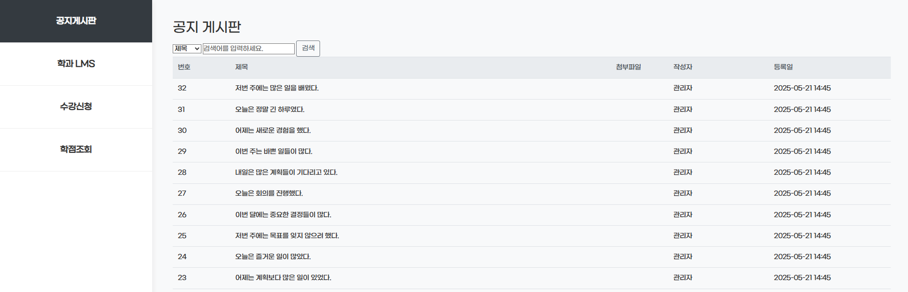
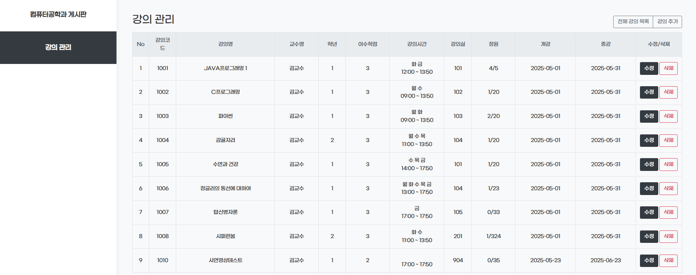
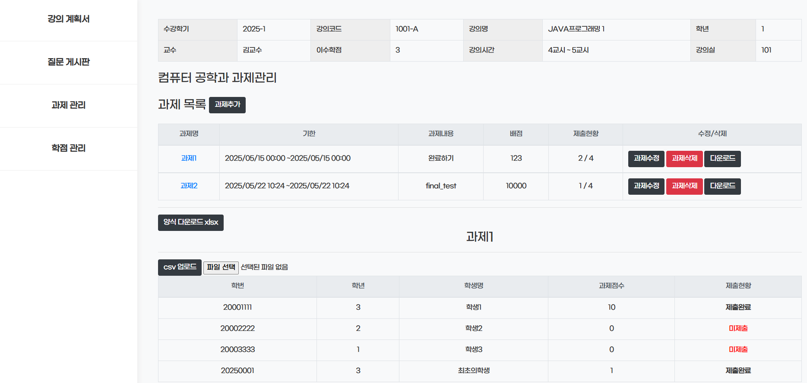

### ⭐ Learning Management System (학사 관리 시스템)

<br>

### 소개 (Overview)

> JSP Model 2(MVC) 아키텍처를 기반으로 구현된 학사 관리 시스템(LMS)입니다.
교수, 학생, 관리자 권한에 따라 수업, 강의, 회원, 게시판 등을 관리할 수 있는 웹 애플리케이션입니다.

<Br>

### ⚙️ 주요 기능 (Features)

- 학생 
  - 강의 목록/과제 조회
  - 수강 신청/취소, 내 정보 확인
  - 게시글 수정/작성

- 교수
  - 강의 개설 / 수정
  - 학생 목록 조회
  - 과제 업로드 및 점수 부여

- 관리자
  - 사용자 전체 관리 (CRUD)
  - 교수/학생 계정 승인
  - 학과/강의/과목 관리

- 인증 & 권한
  - 세션 기반 로그인
  - 관리자/교수/학생 권한 분리
  - 접근 제어

<Br>

### ⚙️ 기술 스택 (Tech Stack)
| 구분                    | 사용 기술                                          |
| --------------------- |------------------------------------------------|
| **Language**          | Java 17 (LTS)                                  |
| **Backend Framework** | JSP, Servlet (Model 2 MVC)                     |
| **DB Layer**          | MyBatis (Mapper Interface + XML 기반), JDBC      |
| **Database**          | MySQL / MariaDB                                |
| **Web / View**        | JSP, JSTL, EL, HTML5, CSS3, JavaScript         |
| **Architecture**      | MVC(Model 2), DAO 패턴, Service Layer, Mapper 구조 |
| **Session/Auth**      | HttpSession 기반 로그인 및 권한(Role) 제어               |
| **Build/Deploy**      | WAR 배포 구조, Apache Tomcat 9                     |
| **Tools**             | GitHub Desktop, Eclipse, HeidiSQL              |
 
<Br>

### 📂 프로젝트 구조 (Project Structure)

```bash
/project-lms-backend
 ├── src/main/java
 │     ├── controllers/           # Servlet Controller
 │     ├── models/
 │     │     ├── users/           # UserDAO, UserDTO
 │     │     ├── boards/          # 게시판 관련 DAO
 │     │     ├── others/          # 강의/학과 등
 │     │     └── mappers/         # MyBatis Mapper
 │     └── MyBatisConnection.java
 │
 ├── src/main/webapp
 │     ├── views/                 # JSP 화면
 │     └── WEB-INF/
 │         ├── lib/               # 라이브러리(JAR)
 │         └── web.xml            # 서블릿 설정

```

<br>

### 📂 전체 아키텍처 (Architecture)
- 전통적인 `JSP Model2(MVC)` 구조
- 역할 분리(`Controller`, `View`, `DAO`) 명확
- `MyBatis`로 `SQL` 관리 분리
세션 기반 인증 + 권한 분기

```bash
[Client] 
   ↓
[JSP View]  ← JSTL, EL
   ↓
[Controller (Servlet)] 
   ↓
[Service / Business Logic] 
   ↓
[DAO] 
   ↓
[MyBatis Mapper (Interface + XML)] 
   ↓
[MySQL Database]
```

<br>

### 🗄 핵심 로직 (Core Logic)

### 1. 관리자 사용자 관리(Admin User Management)

- 관리자 페이지에서 사용하는 회원 조회·등록·수정·삭제 CRUD 구현
- 교수/학생/관리자 권한(Role) 부여/변경 로직 개발
- 서비스 흐름: Controller → DAO → Mapper → JSP
- 회원 관리 기능과 세션 기반 로그인/권한 구조 연동


#### View 

```html
<form action="login" method="post" name="f" onsubmit="return input_check(this)">
<table class="table">
<tr><th>아이디</th><td><input type="text" class="form-control" name="user_no"></td></tr>
<tr><th>비밀번호</th><td><input type="password" class="form-control" name="password"></td></tr>
<tr><td colspan="2"><button class="btn btn-secondary">로그인</button>
<button type="button" class="btn btn-light btn-outline-secondary" onclick="win_open('idForm')">아이디 찾기</button>
<button type="button" class="btn btn-light btn-outline-secondary" onclick="win_open('resetPwForm')">비밀번호 초기화</button>
</td></tr>
</table>
</form>
```
#### Controller
```java
@WebServlet(urlPatterns = {"/users/*"},
initParams = {@WebInitParam(name="view",value="/views/")})
public class UserController extends MskimRequestMapping{
	private UserDao dao = new UserDao();
	private MajorDao majorDao = new MajorDao();
	private Reg_classDao rcDao = new Reg_classDao();
	private NotificationDao NotificationDao = new NotificationDao();
  ...
  
  // 로그인 =================================================================
  @RequestMapping("login")
  public String login(HttpServletRequest request, HttpServletResponse response) {
    // 파라미터 조회
    String user_no = request.getParameter("user_no");
    String password = request.getParameter("password");
    User user = dao.selectOne(user_no);
    String msg = null;
    String url = null;

    if(user == null){ // 아이디가 없는 경우
      msg = "아이디를 확인하세요";
      url = "loginForm";
    } else if (!password.equals(user.getPassword())) {
      msg = "비밀번호를 확인하세요";
      url = "loginForm";
    } else {
      request.getSession().setAttribute("login", user);
      request.getSession().setAttribute("class1", null);
      msg = user.getUser_name() + "님 반갑습니다.";
      url = "../mainLMS/main";
    }
    request.setAttribute("msg", msg);
    request.setAttribute("url", url);
    return "alert";
  }	
```

#### DAO → Mapper

```java
public class User {
  private String user_no;
  private String password;

  public String getUser_no() {
    return user_no;
  }
  public void setUser_no(String user_no) {
    this.user_no = user_no;
  }
  public String getPassword() {
    return password;
  }
  public void setPassword(String password) {
    this.password = password;
  }
```
```java
public class UserDao {
	private Class<UserMapper> cls = UserMapper.class;
	private Map<String, Object> map = new HashMap<>();

	//로그인정보 부르기
	public User selectOne(String user_no) {
		SqlSession session = MyBatisConnection.getConnection();
		try {
			return session.getMapper(cls).selectOne(user_no);
		} catch (Exception e) {
			e.printStackTrace();
		} finally {
			MyBatisConnection.close(session);
		}
		return null;
	}
```
```java
package models.mappers;

import java.util.List;
import java.util.Map;

import org.apache.ibatis.annotations.Delete;
import org.apache.ibatis.annotations.Insert;
import org.apache.ibatis.annotations.Param;
import org.apache.ibatis.annotations.Select;
import org.apache.ibatis.annotations.Update;

public interface UserMapper {

	//사용자 추가
	@Insert("INSERT INTO users (user_no, password, role, email, tel, user_name, gender, user_grade, major_no) " +
	        "VALUES (#{user_no}, #{password}, #{role}, #{email}, #{tel}, #{user_name}, #{gender}, #{user_grade}, #{major_no})")
	int insert(User user);
	
	//로그인
	@Select("select * from users where user_no = #{value}")
	User selectOne(String user_no);
	
	//아이디찾기
	@Select("select user_no from users where user_name=#{user_name} and email=#{email}")
	String userSearch(@Param("user_name") String user_name, @Param("email") String email);
	
```

<br>

### 2. MyBatis 기반 DB 처리(DAO + Mapper) 구조 설계 및 구현

- Mapper 인터페이스 + XML 구조 기반의 DB 접근 방식 구현
- services/dao 계층 전체에 통일된 DB 접근 패턴 적용
- LMS 전 기능(회원·강의·수업·학과·게시글 등)에서 사용되는 공통 기반 제공

#### MyBatisConnection – SqlSessionFactory 구성
```java
public class MyBatisConnection {
  private static SqlSessionFactory sqlMap;
  static {
    String resource = "models/mappers/mybatis-config.xml";
    InputStream input = null;
    try {
      input = Resources.getResourceAsStream(resource);
    } catch(IOException e) { e.printStackTrace(); }
    sqlMap = new SqlSessionFactoryBuilder().build(input);
  }
  public static SqlSession getConnection() {
    return sqlMap.openSession();
  }
  public static void close(SqlSession session) {
    session.commit();
    session.close();
  }
}
```

#### DBConnection
```java
public class DBConnection { //DBConnection 클래스는 객체 불가 => 생성자 접근 불가
	private DBConnection() {}  //생성자. 
	public static Connection getConnection() {
		Connection conn = null;
		try {
			Class.forName("org.mariadb.jdbc.Driver");
			conn = DriverManager.getConnection
					("jdbc:mariadb://kdt.goodee.co.kr:****/LMS","user","****");
		} catch (Exception e) {
			e.printStackTrace();
		} 
		return conn;
	}
	public static void close(Connection conn, Statement stmt, ResultSet rs) {
		try {
			if(rs != null) rs.close();
			if(stmt != null) stmt.close();
			if(conn != null) conn.close();
		} catch(Exception e) {
			e.printStackTrace();
		}
	}
}
```


<Br>

### 🔍 화면 예시 (Screenshots)

#### MainLMS (메인 페이지 / 공지사항)


<br>

#### DeptLMS (학과 게시판 / 강의관리)

<br>

#### ClassLMS (과제/학점 관리)


<Br>

### 📄 배운 점 (What I Learned)

- JSP/Servlet 기반 전통적 MVC 구조 실무식 구현
- MyBatis 기반 DAO/Mapper 구조로 DB 접근 계층 설계
- 세션(Session) 기반 인증·권한 체계 처리
- 프로젝트 전반에 걸친 데이터 흐름 구조 이해
- 웹 요청/응답 흐름(HttpServletRequest/Response) 숙련
- Git을 통한 버전 관리 및 협업 준비

  <Br>

### 📄 추후 개선 계획 (Improvements)

- Spring Boot 기반 구조로 리팩토링
- JPA 도입하여 DAO 계층 단순화
- REST API 기반 구조로 확장
- JWT 기반 인증 적용
- 프론트엔드(Vue/React) 분리형 구조로 발전
